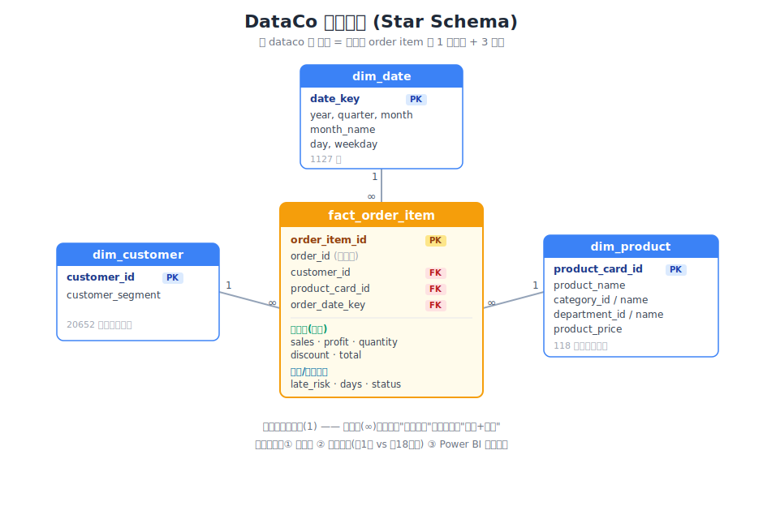

# DataCo 供应链分析——三个业务判断

> 基于 Kaggle [DataCo Smart Supply Chain](https://www.kaggle.com/datasets/shashwatwork/dataco-smart-supply-chain-for-big-data-analysis) 数据集（180,519 订单行 / 65,752 订单 / 118 SKU / 2015-01 ~ 2018-01）的供应链数据分析项目。
>
> **交付物是三个业务判断，「pandas 清洗 → MySQL 星型模型 → Power BI 看板」管道只是取证手段。** 每个判断 = 现象定位 + 量化影响 + 建议动作；Power BI 页面中的核心指标均与 SQL 和 pandas 结果交叉核对一致。

---

## 判断①｜盈利：亏损不在品类，在"深度"——止住深亏，利润接近翻倍

- **现象**：整体利润率 12.03% 看似健康，但 18.71% 的订单行在亏钱。按品类/区域下钻却切不出亏损区：691 个品类×区域组合仅 60 个净亏、合计 -1.45 万（占总亏损 0.4%），SKU 层仅 3 个净亏——聚合净额把亏损藏起来了。
- **量化**：换"亏损深度"维度后集中点浮现——利润率 < -50% 的订单行仅占 **8.69%**，却贡献 **85.3% 的亏损（331 万）**；其中 < -100%（亏穿实收）的超深亏一档独占 53%。**亏损 388 万 ≈ 净利润 397 万：止住这部分，利润从 397 万涨到 785 万——接近翻倍。**
- **动作**：设订单级利润率下限（margin floor）分级管控——**< -100% 硬拦截、-50% ~ -100% 触发审批**。阈值 -50% 来自敏感性分析：往松放（-20%）只多覆盖 10pct 亏损，往紧收（-80%）覆盖率从 85% 断崖跌到 62%。深亏在各品类占比均匀（8.6%~9.2%，系统性漏洞），按深亏金额排序 Fishing / Camping 优先试点。
- 证据：[notebooks/01_eda.ipynb](notebooks/01_eda.ipynb) ｜ 看板页2 [盈利结构](dashboard/power%20bi/盈利结构.png)

## 判断②｜履约：迟发不是发货慢，是承诺口径错配

- **现象**：订单级迟发率 **57.31%**，四年无趋势、五大市场几乎一致（56.5%~57.7%）——排除地域与突发因素，是全局结构性问题。越"快"的等级迟发越狠：First Class **100%**、Second 80%、Same Day 48%、Standard 40%。
- **量化**：根因 = 承诺天数与实际能力错配——First Class 承诺 1 天、实际**恒为 2 天**（9,602 单零波动，张张必迟）；Second Class 承诺 2 天、实际 4.00 天 ≈ Standard 的 3.99 天（**付费加速没换来任何加速**）。约18%的运输等级×市场×品类组合覆盖约80%的迟发订单行；受影响 GMV 约 **2,013 万（占总 GMV 57.2%）**。**率与量分离**：First 订单级迟发率最高，但只占迟发订单行总量 27%；Standard 订单级迟发率最低，却占迟发订单行总量 41%（基数 10 万行）——只治 First 会打错主战场。
- **动作**：**校准承诺口径，而不是催发货**。承诺阶梯反事实测算（历史配送天数不变、只改承诺重判）：57.3%（现状）→ **31.6%**（承诺=各等级实际均值：快线归零、零成本）→ 15.9%（P80）→ 0%（全覆盖），阶梯差异全部来自 Second/Standard 的真实能力不足。Second Class 要么补齐 2 天时效、要么并入 Standard。
- 证据：[notebooks/02_late_delivery_analysis.ipynb](notebooks/02_late_delivery_analysis.ipynb) ｜ 看板页1 [履约总览](dashboard/power%20bi/履约总览.png)

## 判断③｜库存：安全库存资金与销售额排名脱钩——杠杆在提前期，不在服务水平

- **现象**：ABC×XYZ 九宫格显示"钱"与"波动"错位——在102个具有足够销售历史的可测算SKU中，A类7个SKU贡献 **77.6%** 的销售额，且全部落在 X 格（高销量 + 低波动，卖得最多的反而最好预测）。
- **量化**：一刀切 95% 服务水平的安全库存资金 **115.2 万**，其中 **B 类（销售额仅 17.9%）占 89%**——三因子叠加：2017 年新目录上架（在售窗口约 50 周）× 单价最高（均 328）× 周需求 σ 最大（约 70）。教科书式九宫格差异化**反而贵 4.2%**（120.1 万，因为给 A/B 类抬了服务水平）；只降 C 类仅省 2.2%。
- **动作**：调服务水平（z）杠杆很弱；**压缩 B 类补货提前期**——提前期减半资金降 29%（≈30 万，因 SS = z·σ·√L），BZ 格改按单采购。
- **口径说明（本判断最重要的方法论决策）**：XYZ 的周需求波动按"**每 SKU 在售窗口内补零**"计算。数据无下架字段，但活跃 SKU 数连续 27 个月恒定 54 个、2017-04 / 2017-09 两次整批换血（45 / 40 个 SKU 同月末销）→ 商品目录整批切换；**停售后的零不是需求，是商品不存在**。全期补零会把 96/118 个 SKU 误判成 Z 类、总资金少算一半（51 万 vs 115 万）——notebook 内留有三口径对比。窗口 < 8 周的 16 个新品（销售额 0.95%）历史不足，按上市计划另管。
- 证据：[notebooks/03_inventory_abc_xyz.ipynb](notebooks/03_inventory_abc_xyz.ipynb)

---

## Power BI 看板（两页，每页回答一个决策问题）

| 页1 履约总览：货送得准不准、在恶化还是好转、问题集中在哪 | 页2 盈利结构：12% 利润率看着健康，近一半利润被谁吃掉 |
|---|---|
|  |  |

pbix 文件：[power bi/power bi看板.pbix](power%20bi/power%20bi看板.pbix)（Import 模式内嵌数据，**直接打开即可查看，无需数据库密码**；如需用自己重建的数据刷新，按 [Power BI 刷新说明](docs/power_bi_refresh.md) 操作）。

## 数据模型（MySQL 8.0 星型模型）



`fact_order_item`（180,519 行，粒度 = 订单行，PK `order_item_id`）+ `dim_customer`（20,652）/ `dim_product`（118，部门>品类>商品三级）/ `dim_date`（1,127）；CTAS 建表 + 主外键约束，5 条校验全过（行数守恒 / 维表行数 / 0 孤儿 / 0 空值 / 迟发标记核验）。

⭐ **迟发标记核验**（不盲信数据字段）：用 `real > scheduled` 独立重算迟发，与自带 `late_delivery_risk` 对比 **97.5% 一致**；4,423 行差异全部是取消单（2,316 疑似欺诈 + 2,107 客户取消）——没发货谈不上迟发，自带标记判 0 反而是对的，同时反向印证了"迟发率分母应排除取消单"的口径。

## 关键口径（notebook / 看板 / 日志三方一致，详见 [docs/kpi_definitions.md](docs/kpi_definitions.md)）

| 指标 | 口径 | 当前值 |
|---|---|---|
| 迟发率 | 订单级去重；分母排除 `Shipping canceled`（OTIF 标准） | 36,048 / 62,897 = **57.31%** |
| 销售额 GMV | `SUM(sales)` 折扣前；排除未成交（CANCELED+FRAUD） | 3,521 万 |
| 净收入 | `SUM(order_item_total)` 折扣后实收 | 3,164 万 |
| 利润率 | 总利润 ÷ **净收入（折后）**，与行级口径同源 | **12.03%** |
| 亏损分析 | 全量口径（亏损看全部发生额，不排除） | 亏 388 万 / 盈 785 万 → 盈利侵蚀率 49.5% |
| 深亏边界 | 严格 `< -50%`（踩线 108 行归中亏，与 Power BI 计算列一致） | 15,695 行 / 8.69% / 331 万 |
| XYZ 波动 | 周需求 CV，**在售窗口内补零**（窗口<8周新品另管） | X17 / Y70 / Z15 |

**数据边界（诚实声明）**：无运费成本字段 → 亏损定位用负利润而非运费归因；无罚金/流失字段 → 迟发影响用"受影响 GMV"表述；无库存快照 → 判断③是两种备货**策略的对比测算**而非库存审计；无"齐套"字段 → 只能做 OTD 做不了完整 OTIF。本数据为教学模拟数据集，57% 迟发率不代表真实企业水平——**讲方法，不讲绝对值**。

## 目录结构

```
data/raw            原始 CSV（不上传，见下方复现步骤）
data/star_csv       从 MySQL 导出的四张星型表 CSV（自动生成，不上传）
notebooks           00_clean_load.py（清洗入库）/ 01_eda / 02_late_delivery / 03_inventory_abc_xyz
sql                 schema.sql（星型模型 DDL + 校验 SQL）
scripts             一键复现 / 建模 / 导出 / 校验 / 安全检查脚本
dashboard           01/02/03 分析图表 + power bi/ 两页看板截图
power bi            power bi看板.pbix
docs                KPI 口径 / 字段清单 / Power BI 刷新说明 / star_schema.svg
report              一页结论报告源文件、生成脚本与 PDF
output/pdf          自动生成的最终 PDF
plan                项目计划与执行清单 + 项目日志
requirements.txt    精确版本的 Python 依赖
.env.example        可公开的数据库配置模板（不含真实密码）
```

## 一键复现

前置条件：Python 3.13、MySQL 8.0，以及一个具有建库和建表权限的本机 MySQL 账号。

1. 克隆仓库并安装环境：`python -m pip install -r requirements.txt`；也可用 `conda env create -f environment.yml`。
2. 从 [Kaggle](https://www.kaggle.com/datasets/shashwatwork/dataco-smart-supply-chain-for-big-data-analysis) 下载 `DataCoSupplyChainDataset.csv` 与 `DescriptionDataCoSupplyChain.csv`，放入 `data/raw/`。程序按 `latin-1` 读取；`tokenized_access_logs.csv` 与本项目无关，不需要下载或公开。
3. 复制 `.env.example` 为 `.env`，只在本机填写 MySQL 账号和密码。`.env`、原始 CSV、自动导出的星型 CSV 与执行中间文件均已被 Git 忽略。
4. 在仓库根目录运行：`python scripts/reproduce.py`。

该命令依次完成原始数据检查、清洗入库、星型模型重建、四张星型 CSV 导出、KPI 校验、三份 Notebook 执行、18 张成果图导出、一页 PDF 重建和隐私检查。已有数据库时可用 `python scripts/reproduce.py --skip-load`；只检查模型与指标时可再加 `--skip-analysis --skip-report`。

执行成功的主要验收值：事实表 180,519 行、订单级迟发率 57.31%、GMV 3,521.44 万、净收入 3,164.47 万、利润率 12.03%、亏损订单行占比 18.71%。

Power BI 的 pbix 采用 Import 模式并内嵌演示数据，下载后可直接查看；刷新到自己重建的数据不需要公开密码，具体步骤见 [docs/power_bi_refresh.md](docs/power_bi_refresh.md)。

## 公开仓库与隐私边界

- **会进入 Git**：代码、SQL、正式 Notebook、图表、Power BI 文件、文档、可公开的 `.env.example` 和最终 PDF。
- **不会进入 Git**：真实 `.env`、Kaggle 原始 CSV、数据库导出的星型 CSV、Notebook 执行副本、缓存和本机探索稿。
- 提交前运行 `python scripts/security_check.py`；它会检查真实凭据是否被跟踪，并扫描本机绝对路径、IP 地址和疑似明文密码。更多规则见 [SECURITY.md](SECURITY.md)。

## 技术栈

Python (pandas / SQLAlchemy / seaborn / scipy) · MySQL 8.0（星型模型 / 窗口函数帕累托） · Power BI（DAX 度量值 / 计算列） · Git
